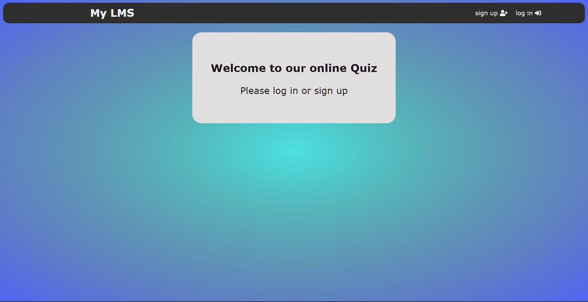

# Lms Quiz Website

## Description

- This is a mini LMS with one feature: quiz taking for students and quiz creation for professor.

- Created using PHP, JavaScript, AJAX and CSS.

## Screenshot

</img>

## Installation

- Clone or download the project

- Install XAMPP

- Put the project folder in xampp/htdocs/< Project Folder >
  
- From XAMPP start the Apache and MySQL

- Open MySQL admin, and execute the following sql:

``` sql
CREATE DATABASE lmsdb;

USE  lmsdb;

CREATE TABLE questions(
    qid INT(250) AUTO_INCREMENT NOT NULL PRIMARY KEY,
    question VARCHAR(250) NOT NULL,
    choice1 VARCHAR(250),
    choice2 VARCHAR(250),
    choice3 VARCHAR(250),
    choice4 VARCHAR(250),
    answer INT(250) NOT NULL);

CREATE TABLE users(
    uid INT(11) AUTO_INCREMENT NOT NULL PRIMARY KEY,
    userName VARCHAR(128) NOT NULL  ,
    userPwd VARCHAR(128) NOT NULL,
    userJob VARCHAR(128) NOT NULL);

ALTER TABLE `users` ADD UNIQUE(`userName`);


CREATE TABLE settings (
    quizDate DATE NOT NULL,
    quizDuration TIME DEFAULT '00:10:00' NOT NULL
)
```

- Finally open <http://localhost/lms-quiz-project/>

- Create a professor user then create a quiz.

- Create a student user and take the quiz.
  